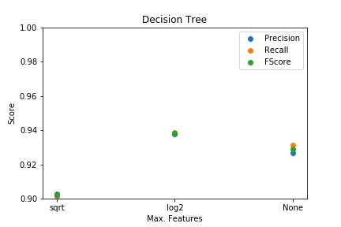

# Análise Experimental da Detecção de Células de Câncer de Mama

Projeto da matéria de Sistemas Inteligentes, aula ministrada no terceiro quadrimestre de 2019, na UFABC. 

## Integrantes 
* [André A. Florentino](https://www.github.com/AndreJomon)
* [Danilo C. P. dos Santos](https://www.github.com/dancps)
* [Felipe K. Kobayashi](https://www.github.com/felipe-k)
* [Vinícius V. Gonçalves](https://www.github.com/Vimerum)

# Uso
O projeto utiliza as bibliotecas [Scikit-learn](https://scikit-learn.org/) para implementação dos métodos de Machine Learning, [Pandas](https://pandas.pydata.org/) para análise e estruturação de dados, [Seaborn](https://seaborn.pydata.org/) e [Matplotlib](https://matplotlib.org/) para visualização dos resultados. Todas estas podem ser encontradas no arquivo `requirements.txt` do repositório e podem ser instaladas pelo gerenciador de pacotes `pip` usando o comando:
```bash
pip install -r requirements.txt
```
Todo o processo descrito no projeto pode ser encontrado e executado no [notebook do grupo](./Projeto_SI.ipynb).


## Resultados
### Decision Tree


### K-Nearest Neighbors


### Multi-layer Perceptron


### Linear Support Vector Machine


